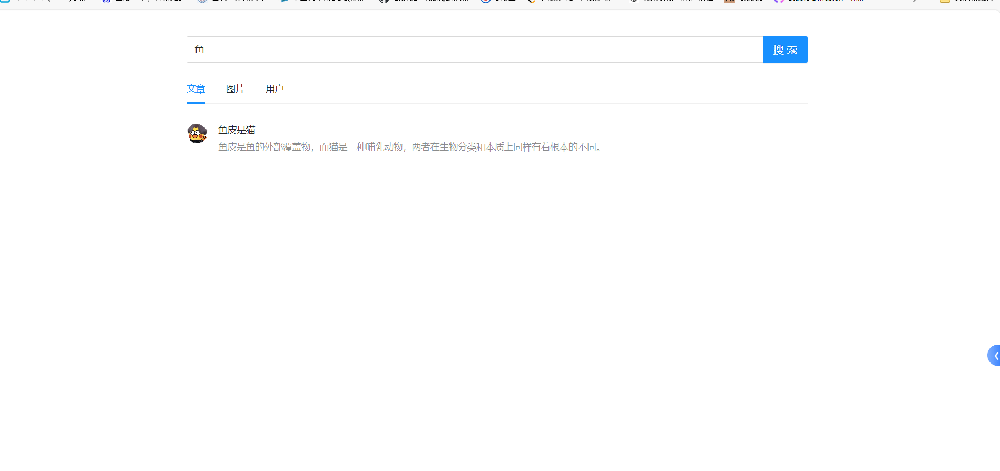
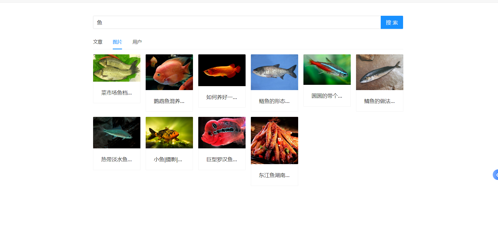

# 聚合搜索平台

## 项目介绍

- 企业级一站式聚合搜索平台，基于 Vue3 前端+ Spring Boot 后端+ Elastic Stack

- 对用户来说，使用该平台，可以在同一个页面集中搜索出不同来源、不同类型的内容，提升用户的检索效率和搜索
体验。

## 项目功能展示

### 搜索与关键词 '鱼' 相关的文章 

### 搜索与关键词 '鱼' 相关的图片

### 搜索与关键词 '鱼' 相关的用户
